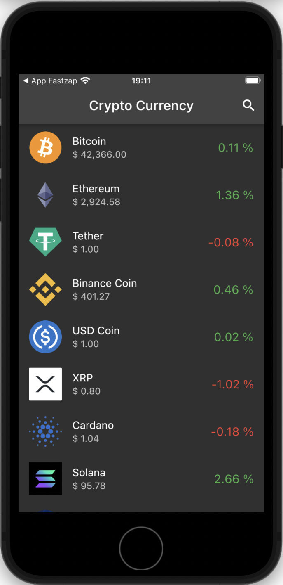

# crypto_currency

Este app foi desenvolvido utilizando o **GETX**, que por sua vez é um sistema de injeção de dependências altamente poderoso no mundo do Flutter

 

Este é um projeto Flutter usado para estudo, que faz uso da API **coingecko** para realizar uma busca pelas cripto moedas mais valorizadas no momento.

 

api usada: https://api.coingecko.com/api/v3

<h2 align="center">Screenshot</h2>

    

 

   Feito com ❤️ by <b>welitonsousa</b>

